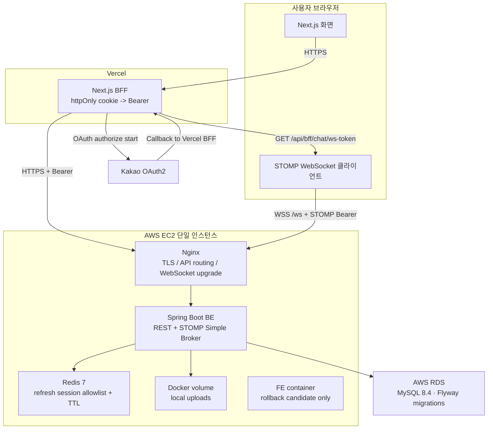

# Attacca 시스템 아키텍처

## 문서 목적

이 문서는 현재 운영 중인 Attacca의 배포 경계와 요청 흐름을 설명한다. README와 포트폴리오에서 사용하는 시스템 아키텍처의 기준 문서이며, 미래에 도입하지 않은 인프라를 현재 구성처럼 표현하지 않는다.

## 현재 구성

## 요청 흐름

1. 브라우저의 일반 API 요청은 Vercel의 Next.js BFF가 받고, BFF는 httpOnly `access_token` 쿠키를 읽어 `Authorization: Bearer` 헤더로 변환한다.
2. Nginx는 API 요청을 EC2의 Spring Boot BE로 전달한다. Spring Security가 access token을 검증한다.
3. BE는 영속 데이터에 AWS RDS MySQL, refresh session에 Redis, 업로드 파일에 EC2 Docker volume을 사용한다. 인증 쿠키는 30분 JWT `access_token`과 14일 opaque session ID `refresh_session`이며 둘 다 HttpOnly다. Redis에는 refresh session 원문이 아니라 SHA-256 기반 키와 회원 연결 정보를 TTL로 저장한다.
4. OAuth 로그인은 Vercel의 Kakao 시작 경로에서 인가를 시작하고, Kakao callback은 Vercel BFF로 돌아온다.
5. 채팅은 FE가 Vercel BFF의 `/api/bff/chat/ws-token`에서 httpOnly access cookie의 값을 받아 STOMP `CONNECT` 헤더에 Bearer로 넣고, 브라우저가 `wss://api.attacca.site/ws`에 직접 연결한다. 이 특수 경로는 토큰을 브라우저 JavaScript에 노출하는 트레이드오프가 있다.
6. WebSocket handshake origin allowlist와 STOMP 인증/인가는 BE의 `WebSocketConfig` 및 `StompAuthChannelInterceptor`가 처리한다. Nginx는 TLS 종료·요청 전달·WebSocket upgrade를 담당한다.
7. 채팅은 단일 BE 인스턴스의 인메모리 Simple Broker를 사용한다.

## 경계와 보류 항목

| 항목 | 현재 상태 | 포트폴리오 표현 |
|---|---|---|
| Frontend | Vercel 운영 | 현재 운영 구성 |
| EC2 FE | 컨테이너 유지, rollback 후보 | 공개 FE와 구분해 rollback 후보로 표시 |
| API·WebSocket | EC2 Nginx + Spring Boot | 현재 운영 구성 |
| Refresh session | Redis allowlist + TTL | 현재 운영 구성 |
| 업로드 | EC2 Docker volume | 현재 운영 구성, 백업/S3는 미검증 |
| Database | AWS RDS MySQL 8.4 운영 | 현재 운영 구성, EC2 외부 관리형 DB |
| Blue/Green | 미도입 | 외부 STOMP broker relay와 공유 presence 선행 |

## Figma 표현 기준

Figma 산출물은 이 문서의 구조를 포트폴리오용으로 시각화한다.

- **레이어 1: Client** — 브라우저, Next.js 화면, STOMP 클라이언트
- **레이어 2: Delivery** — Vercel BFF와 EC2 Nginx
- **레이어 3: Application** — Spring Boot REST, STOMP Simple Broker
- **레이어 4: State** — AWS RDS MySQL, EC2 Redis, EC2 Docker volume
- **외부 연동** — Kakao OAuth2
- **표현 규칙** — 실선은 현재 요청 흐름, 점선은 확장 검토 항목, 미도입 인프라는 회색 주석으로 표시

Figma에서는 API와 WebSocket 흐름을 서로 다른 선으로 구분하고, Redis의 `refresh session` 저장과 RDS의 영속 데이터 저장을 별도 노드로 표현한다. RDS는 현재 운영 구성이다. Blue/Green·외부 STOMP broker·공유 presence만 현재 구성과 분리해 “Future consideration” 영역에 둔다. EC2 FE는 공개 경로가 아닌 rollback 후보로만 표시한다.

## 참고

- [AIBE6 FinalProject Team05 BE](https://github.com/predevho/AIBE6_FinalProject_Team05_BE) — 프로젝트 소개·기술 스택·시스템 아키텍처·ERD를 앞에 배치하는 README 구성 참고

## Figma 산출물

- [Attacca 시스템 아키텍처](https://www.figma.com/design/zMipjdKveCpZY3HqIDYaQx/Pokade-%25EB%2590%259C%25ED%2591%259C---%25EC%2586%25AC%25EB%259D%25BC%25EC%259D%B4%25EB%2593%259C-%25EC%2586%258C%25EC%258A%A4?node-id=74-3&p=f) — 기존 Pokade 파일의 `Attacca Architecture` 페이지
- Page 1의 기존 Pokade 프레임은 유지하고, 복사 프레임 `77:2`의 내용만 Attacca 기준으로 수정했다.
- [Attacca Page 1 아키텍처 (운영)](https://www.figma.com/design/zMipjdKveCpZY3HqIDYaQx?node-id=77-2&p=f) — Vercel 공개 FE·EC2 Nginx/Spring Boot/Redis/로컬 볼륨·별도 AWS RDS MySQL·Kakao OAuth2 기준의 대표 산출물
- 기존 `Attacca Architecture` 독립 페이지는 레이어 중심의 보조 프레임으로 유지한다.
